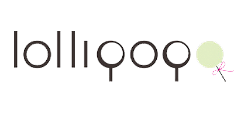

<p align="center">
  
  <br/><a href="https://cocoapods.org/pods/Lollipop">
  
  
  
  
  <br/>
  
  
  <br/>
  
  
  
  </a>
</p>

***

# Introduction/介绍

## What's this?/这是什么？

`Lollipop` is a syntactic sugar for `Auto Layout`.

`Lollipop` 是一块 `Auto Layout` 的语法糖。

<p align="center">
  
</p>

## Requirements/要求

* iOS 9.0+
* macOS 10.11+
* tvOS 9.0+
* Xcode 8+ with Swift 3+

## Installation/安装

#### CocoaPods

```ruby
pod 'Lollipop'
```

## Contribution/贡献

You are welcome to fork and submit pull requests.

## License/许可

`Lollipop` is open-sourced software, licensed under the `MIT` license.

## API

```swift
center(in:offset:priority:active:)

centerX(equalTo:offset:priority:active:)
centerX(equalTo:offset:priority:active:)

centerY(equalTo:offset:priority:active:)
centerY(equalTo:offset:priority:active:)

edges(equalTo:insets:priority:active:)
edges(top:leading:bottom:trailing:insets:priority:active:)

size(equalTo:priority:active:)
size(equalTo:by:priority:active:)

origin(equalTo:offset:priority:active:)

width(_:to:priority:active:)
width(_:to:multiplier:offset:priority:active:)
width(_:to:multiplier:offset:priority:active:)
width(from:to:priority:active:)

height(_:to:priority:active:)
height(_:to:multiplier:offset:priority:active:)
height(_:to:multiplier:offset:priority:active:)
height(from:to:priority:active:)

leading(_:to:offset:priority:active:)
leading(_:to:offset:priority:active:)

left(_:to:offset:priority:active:)
left(_:to:offset:priority:active:)

trailing(_:to:offset:priority:active:)
trailing(_:to:offset:priority:active:)

right(_:to:offset:priority:active:)
right(_:to:offset:priority:active:)

top(_:to:offset:priority:active:)
top(_:to:offset:priority:active:)

bottom(_:to:offset:priority:active:)
bottom(_:to:offset:priority:active:)
```

## Samples/示例

```swift
import Foundation
#if os(OSX)
    import AppKit

    public typealias Color = NSColor
    public typealias Controller = NSViewController
#else
    import UIKit

    public typealias Color = UIColor
    public typealias Controller = UIViewController
#endif
import Lollipop

public extension Controller {
    public func addItems(to v: ALView) {
        let max = 10
        for i in 1...max {
            let value: CGFloat = 1 - CGFloat(i) / CGFloat(max)
            let item = ALView()
            item.setColor(Color(red: value, green: value, blue: value, alpha: 1.0))
            v.addSubview(item)
            item.width(.equal, to: v, multiplier: value)
            item.height(.equal, to: item.widthAnchor)
            item.center(in: v)
        }
    }
}

class ViewController: Controller {
    override func viewDidLoad() {
        super.viewDidLoad()
        addItems(to: self.view)
    }
}
```
